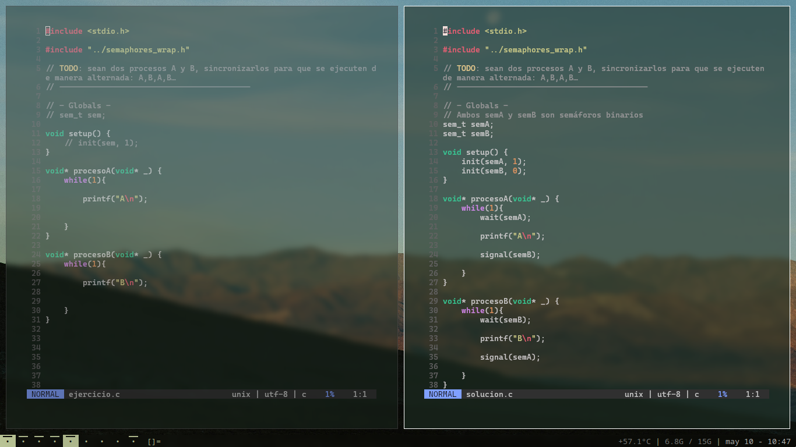
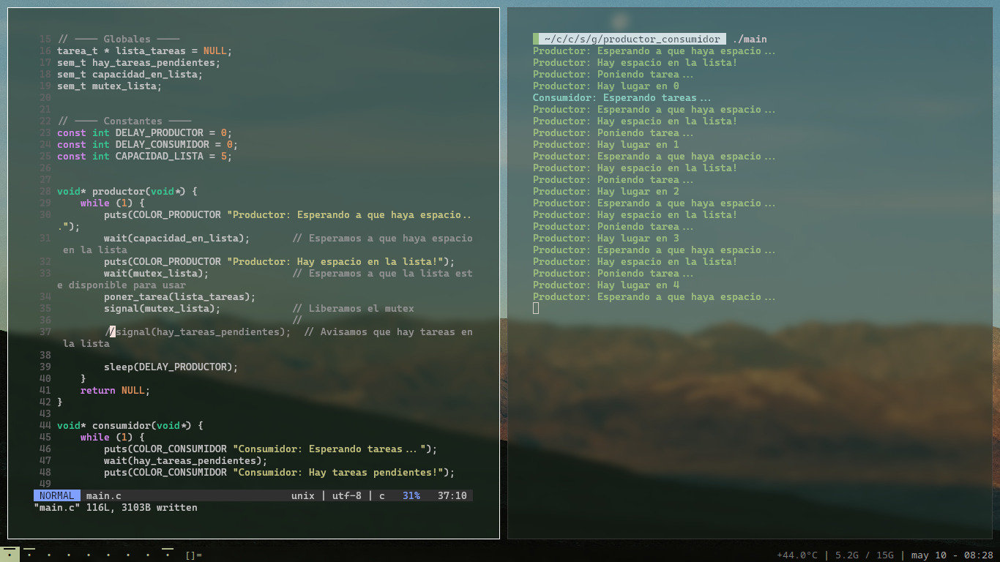
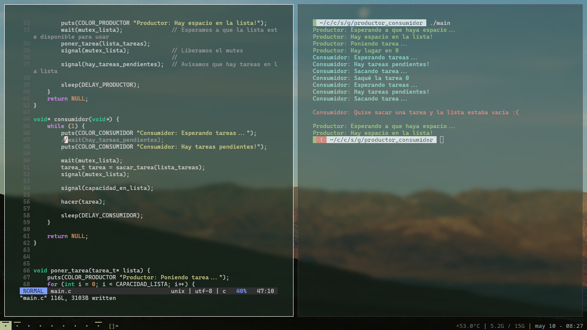

# Ejercicios sincro
Repo con la resolución de algunos ejercicios de [esta guía](https://docs.google.com/document/d/1FpUSnTKrf_Da-aqMtZWpaEhZeH7ljRsABjX-q5M8QsM) de sincro en código. Con suerte, esto ayuda a bajar un poco a tierra los temas, los tipos de semáforos y eso.

## Ejercicios tipo BACA
En cada una de las carpetas [4](4/), [5](5/), [5_](5_/) y [6](6/) hay un archivo (_ejercicio.c_) con la template sin sincronizar y otro archivo (_solucion.c_) con el mismo código pero con los semáforos puestos. Los programas están hechos como para que sea trivial adaptarlos a nuevos ejercicios; la idea es que sea una herramienta más para jugar y agarrarle la mano a los semáforos.

## Ejemplo productor-consumidor
Además de las carpetas 4-6, está la carpeta de [productor consumidor](productor_consumidor). Tiene el ejemplo más básico y típico de productor-consumidor; así como está, funciona, ya está sincronizado, todo. Está hecho para ser interactivo, la idea es tocar el código y ver que pasa. Hay algunas constantes al principio de [main.c](productor_consumidor/main.c) que también está bueno revisar para hacer que el problema se manifieste más rápido o tarde más en aparecer.

#### Ejemplo 1
Si comentamos el _wait_ de tareas pendientes, vemos que el consumidor trata de sacar tareas hasta que la lista está vacía y rompe. En este ejemplo, el productor solo llegó a poner una tarea.

#### Ejemplo 2
Si comentamos el _signal_ de tareas pendientes, el productor ejecuta hasta que llena la lista y el consumidor no saca ninguna tarea porque el productor nunca le avisó que había tareas pendientes. En este caso, el productor llega a poner 5 tareas y luego para porque la lista esta llena.

#### Comparación con go
Dejé en la misma carpeta un archivo [main.go](productor_consumidor/main.go). Está ahí para ser un punto de comparación entre C y Go. [main.go](productor_consumidor/main.go) hace, en un principio, lo mismo que [main.c](productor_consumidor/main.c) pero mejor y con menos líneas, usando los canales de go. Se puede correr con `go run main.go` (tiene que estar go instalado).

## Uso
Todas las carpetas tienen un link al Makefile en root. Estando en cualquiera de las carpetas, hacer `make` compila todos los .c que encuentre, tiene que estar instalado make y gcc. Probé los programas en la [vm](https://docs.utnso.com.ar/recursos/vms#ubuntu-server-64-bit), en windows 11 y en un derivado de ubuntu y andaba, cualquier cosa me hablan por [telegram](https://t.me/eliasmouesca) o por [mail](mailto:emouesca@frba.utn.edu.ar), cualquier idea también es bienvenida.
